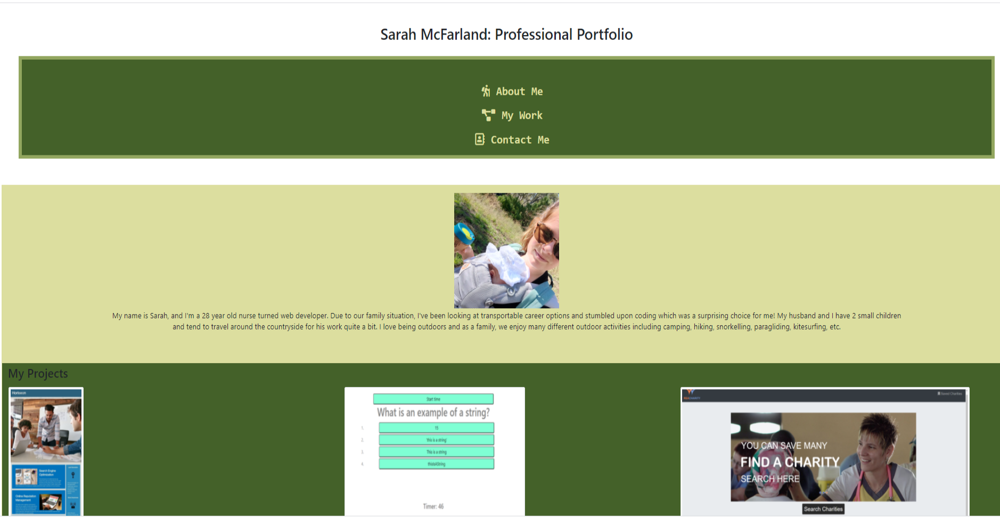

# professional-portfolio

## Description

A simple professional portfolio page including a recent photo, a selection of projects, linked CV, and contact links.

## Acceptance Criteria

* Submit an updated portfolio featuring Project 1 and two exemplary homework assignments.

* Submit an updated GitHub profile with pinned repositories featuring Project 1 and two exemplary assignments.

* Submit an updated resume

* Submit an updated LinkedIn profile

## Portfolio Screenshot

## Link

[Sarah McFarland's portfolio page](file:///C:/Users/smcfa/Documents/PortfolioWk2/professional-portfolio/index.html)